# Documentación de Flujo – QA Automation Challenge

## 1. Propósito

Este documento describe los flujos de prueba automatizados implementados para el desafío técnico **QA Automation Challenge**.

La solución cubre las siguientes capas:

* Automatización móvil sobre Android.
* Automatización de servicios API.
* Validación de contratos con JSON Schema.
* Pruebas de eventos usando un broker compatible con Kafka.
* Generación de reportes con Allure.

El objetivo de este documento es explicar el flujo de ejecución de punta a punta, los escenarios automatizados, las decisiones técnicas tomadas y los resultados esperados.

---

## 2. Alcance de la Solución

La automatización implementada valida los siguientes frentes:

| Capa       | Herramientas                       | Objetivo                                           |
| ---------- | ---------------------------------- | -------------------------------------------------- |
| Mobile     | Appium, WebdriverIO, UiAutomator2  | Validar flujos críticos de la app Android          |
| API        | Playwright, AJV                    | Validar endpoints, respuestas y contratos          |
| Eventos    | Redpanda, KafkaJS, Playwright, AJV | Validar publicación, consumo y contrato de eventos |
| Reportería | Allure                             | Visualizar resultados de ejecución                 |

---

## 3. Flujo General de Ejecución

El flujo general de ejecución se divide por capas para mantener independencia, trazabilidad y facilidad de mantenimiento.

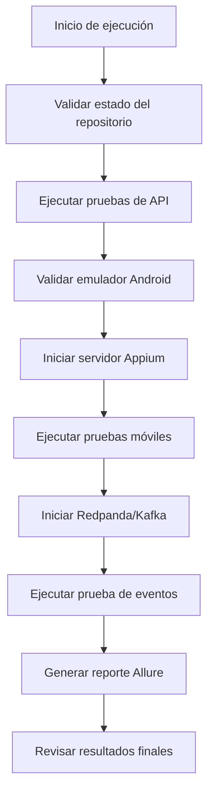

---

## 4. Estructura del Proyecto

El proyecto está organizado por responsabilidad funcional y técnica.

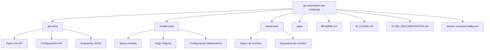

### Archivos principales

| Archivo / Carpeta          | Descripción                                                |
| -------------------------- | ---------------------------------------------------------- |
| `README.md`                | Documentación general del proyecto, comandos y cobertura   |
| `AI_USAGE.md`              | Explicación del uso responsable de IA                      |
| `FLOW_DOCUMENTATION.md`    | Documentación detallada de los flujos automatizados        |
| `mobile-tests`             | Automatización móvil con Appium y WebdriverIO              |
| `api-tests`                | Automatización de API con Playwright y AJV                 |
| `event-tests`              | Prueba opcional de eventos con KafkaJS y Redpanda          |
| `apps`                     | APK usado para la ejecución móvil                          |
| `docker-compose.kafka.yml` | Configuración de Redpanda como broker compatible con Kafka |

---

## 5. Flujo de Automatización Móvil

### 5.1 Objetivo

Validar flujos críticos de usuario en una aplicación Android usando Appium, WebdriverIO y UiAutomator2.

### 5.2 Precondiciones

Antes de ejecutar las pruebas móviles se debe cumplir lo siguiente:

* El emulador Android debe estar encendido.
* ADB debe detectar el dispositivo.
* El servidor Appium debe estar corriendo en el puerto `4723`.
* El APK debe estar disponible en la carpeta `apps`.

Comando para validar el emulador:

```bash
adb devices
```

Resultado esperado:

```text
emulator-5554   device
```

Comando para iniciar Appium:

```bash
appium
```

---

## 6. Flujo Mobile 1 – Apertura de la Aplicación

### Objetivo

Validar que la aplicación móvil abra correctamente y muestre el catálogo de productos.

### Flujo

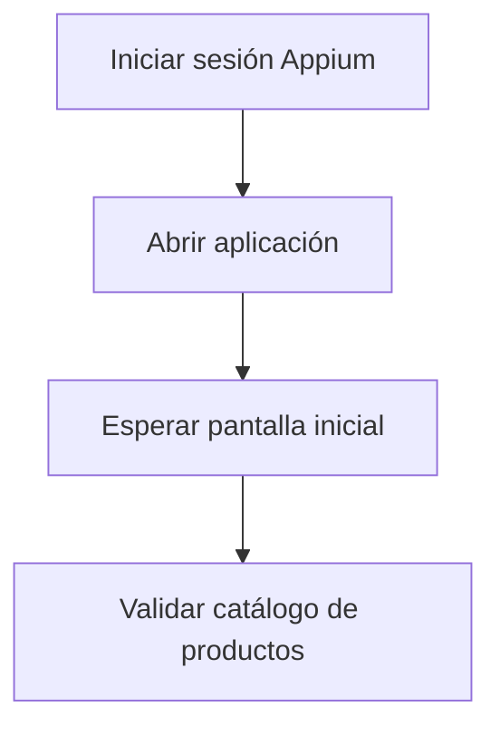

### Resultado esperado

La aplicación debe abrir correctamente y el catálogo de productos debe estar visible.

---

## 7. Flujo Mobile 2 – Catálogo y Carrito

### Objetivo

Validar que un usuario pueda seleccionar un producto, abrir su detalle, agregarlo al carrito y verificar que el producto aparezca correctamente en el carrito.

### Flujo

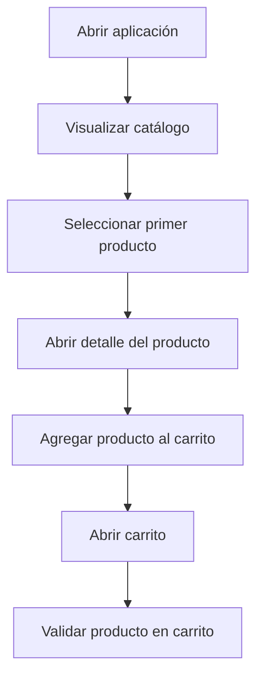

### Decisión técnica

Durante la validación de selectores, se identificó que algunos elementos visibles no eran necesariamente los más estables para automatizar.

En el flujo de catálogo, el título del producto era visible, pero el elemento más confiable para hacer clic era la imagen del producto. Para confirmar esto se inspeccionó la jerarquía real de Android usando:

```bash
adb shell uiautomator dump
```

Con base en esa validación, se seleccionó un `resourceId` estable asociado a la imagen del producto.

### Resultado esperado

El producto agregado desde el catálogo debe visualizarse correctamente dentro del carrito.

---

## 8. Flujo Mobile 3 – Login

### Objetivo

Validar el comportamiento del login exitoso y del login negativo.

### Escenarios cubiertos

* Login exitoso con credenciales válidas.
* Login negativo con usuario bloqueado.

### Flujo

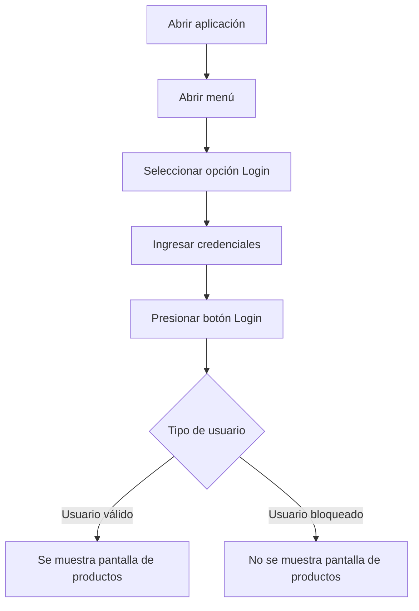

### Decisión técnica

Para el escenario negativo, la validación se enfocó en el comportamiento esperado de negocio: un usuario bloqueado no debe acceder a la pantalla de productos.

Esta decisión es más estable que depender de un mensaje de error dinámico en la interfaz.

### Resultados esperados

* El usuario válido debe acceder correctamente a la pantalla de productos.
* El usuario bloqueado no debe acceder a la pantalla de productos.

---

## 9. Flujo de Automatización API

### Objetivo

Validar operaciones principales de API usando Playwright y AJV.

### Endpoints cubiertos

* Autenticación.
* Creación de reserva.
* Actualización de reserva.

### Flujo general API

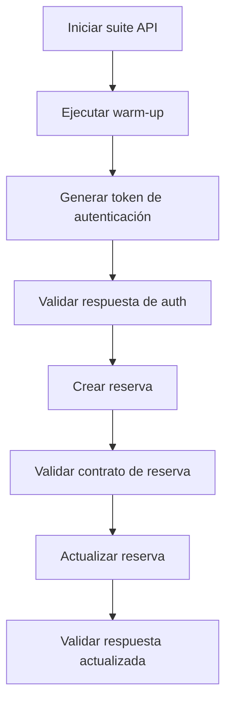

---

## 10. Flujo API 1 – Autenticación

### Objetivo

Generar un token de autenticación válido y validar el tiempo de respuesta contra el SLA requerido.

### Validaciones

* Código de estado HTTP.
* Presencia del token.
* Tiempo de respuesta menor a `1.5` segundos.

### Decisión técnica

Se ejecuta una solicitud de calentamiento antes de medir el endpoint `/auth`.

Esto evita incluir factores externos como resolución DNS, negociación TLS o comportamiento de arranque en frío de una API pública dentro de la medición real del SLA.

### Resultado esperado

El endpoint de autenticación debe retornar un token válido y responder dentro del SLA definido.

---

## 11. Flujo API 2 – Creación de Reserva

### Objetivo

Crear una reserva y validar que la respuesta cumpla con el contrato esperado mediante JSON Schema.

### Flujo

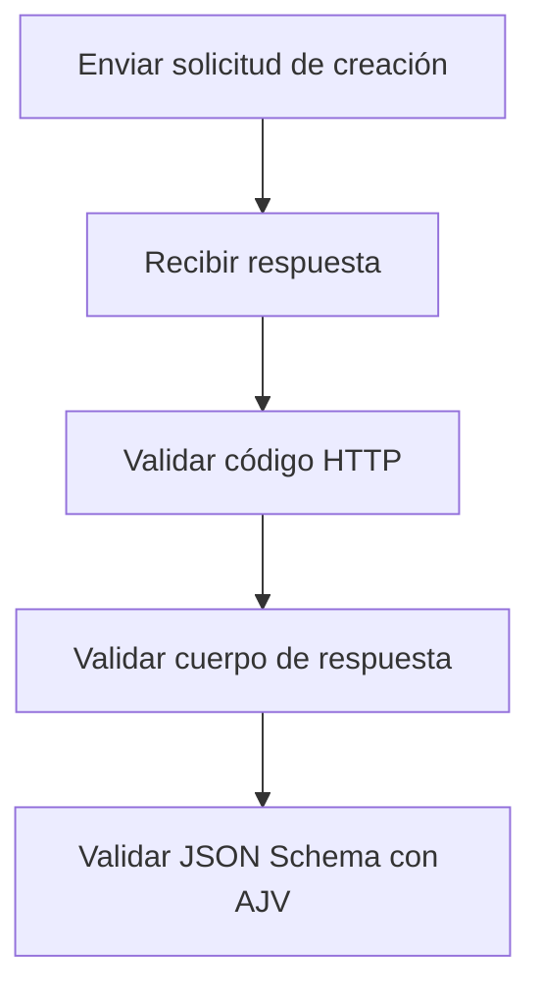

### Resultado esperado

La reserva debe crearse correctamente y la respuesta debe cumplir con el contrato esperado.

---

## 12. Flujo API 3 – Actualización de Reserva

### Objetivo

Actualizar una reserva existente usando un token válido.

### Flujo

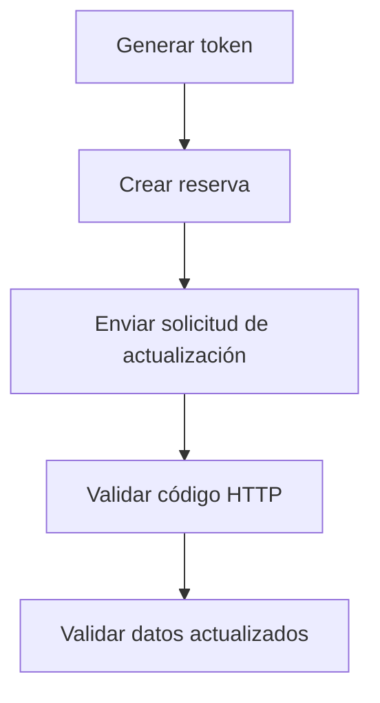

### Resultado esperado

La reserva debe actualizarse correctamente y la respuesta debe reflejar los datos modificados.

---

## 13. Flujo de Eventos – Kafka Compatible

### Objetivo

Validar un flujo orientado a eventos usando Redpanda, KafkaJS, Playwright y AJV.

### Precondiciones

* Docker Desktop debe estar corriendo.
* Redpanda debe estar levantado mediante Docker Compose.
* La variable `KAFKA_ENABLED=true` debe estar configurada antes de ejecutar la prueba.

Comando para iniciar Redpanda:

```bash
docker compose -f docker-compose.kafka.yml up -d
```

Comando para ejecutar la prueba de eventos:

```bash
set KAFKA_ENABLED=true
npm run test:events
```

### Flujo

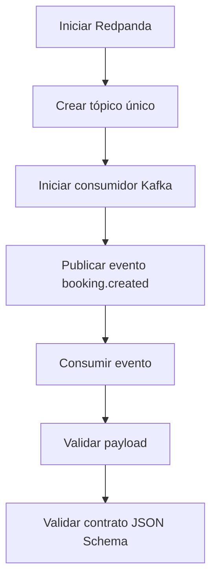

### Decisión técnica

Se crea un tópico único por ejecución para evitar interferencias con mensajes antiguos o pruebas anteriores.

Esto mejora el aislamiento del test y reduce el riesgo de falsos positivos o falsos negativos.

### Resultado esperado

El evento debe publicarse, consumirse y validarse correctamente contra el contrato JSON Schema esperado.

---

## 14. Flujo de Reportería – Allure

### Objetivo

Generar un reporte visual de la ejecución automatizada.

### Flujo

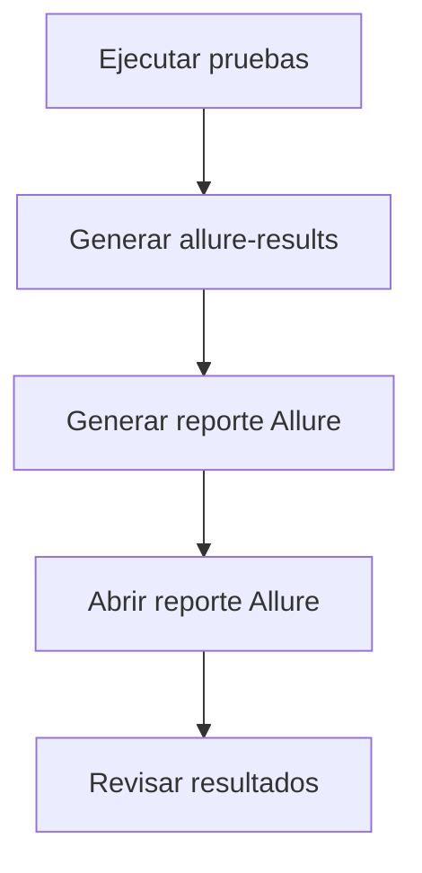

Comandos:

```bash
npm run report:generate
npm run report:open
```

### Resultado esperado

Allure debe mostrar las suites ejecutadas y su estado final.

---

## 15. Resumen de Comandos

### API

```bash
npm run test:api
```

### Mobile

```bash
npm run test:mobile
```

### Eventos

```bash
docker compose -f docker-compose.kafka.yml up -d
set KAFKA_ENABLED=true
npm run test:events
```

### Allure

```bash
npm run report:generate
npm run report:open
```

### Git

```bash
git status
```

Resultado esperado:

```text
nothing to commit, working tree clean
```

---

## 16. Flujo de Validación Final

Antes de entregar el proyecto, se recomienda ejecutar el siguiente flujo:

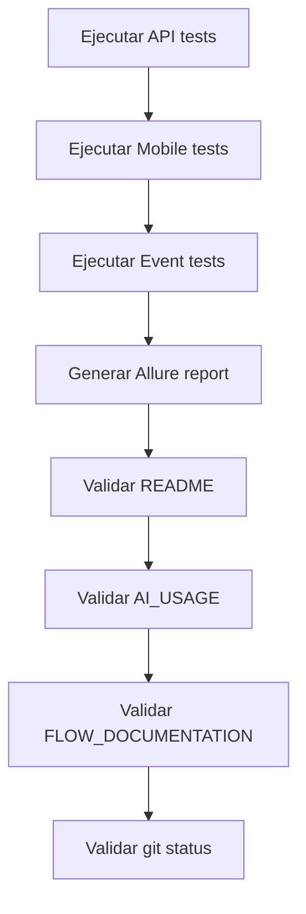

---

## 17. Conclusión

La solución implementada valida los principales flujos de calidad requeridos para el desafío técnico:

* Flujos críticos de aplicación móvil.
* Flujos principales de servicios API.
* Validación de contratos mediante JSON Schema.
* Flujo orientado a eventos usando un broker compatible con Kafka.
* Reportería de ejecución con Allure.

El proyecto está estructurado, documentado y preparado para ejecutarse mediante scripts npm de forma clara, mantenible y reproducible.
